# DESCRIPTION

An online shop with skincare products, an ASP NET CORE MVC application, version net8.0.
The UI is based on bootstrap watch theme "Litera".

# DEPENDENCIES

- Microsoft.AspNetCore.Identity.EntityFrameworkCore 8.0.11
- Microsoft.AspNetCore.Identity.UI 8.0.10;8.0.11
- Microsoft.AspNetCore.EntityFrameworkCore 8.0.11
- Microsoft.AspNetCore.EntityFrameworkCore.Relational 8.0.11
- Microsoft.AspNetCore.EntityFrameworkCore.Sqlite 8.0.11
- Microsoft.AspNetCore.EntityFrameworkCore.SqlServer 8.0.11
- Microsoft.AspNetCore.EntityFrameworkCore.Tools 8.0.11
- Microsoft.VisualStudio.Web.CodeGeneration.Design 8.0.7

# HOW TO RUN?

### 1. Prerequisites

Ensure you have installed the latest version of git and Docker on your operating system and also .NET SDK (optional): If you want to run the application without Docker for debugging purposes.

### 2. Clone the Repository
Clone your project repository to your local machine:
```bash
  git clone git@github.com:nataliastaszel/nSkin.git
````

### 3. Build the Docker Images

Navigate to the folder containing the `compose.yml` file and build the image:

```bash
  docker compose build
```

### 4. Start the Services

Run the application using Docker Compose:

```bash
  docker compose up
```

### 5. Access the Application

After the services start, open your browser and navigate to:

Application: http://localhost:8080

### 6. Stop the Application

To stop the application, press Ctrl + C in the terminal where docker-compose up is running. Alternatively, stop the containers using:

```bash
    docker compose down
```

### 7. Troubleshooting

##### Container Permissions

If you encounter issues with permissions for wwwroot (e.g., saving product images), ensure the necessary folders exist and have proper permissions on your host system:

```bash
  mkdir -p ./nSkinShop/wwwroot/images/product
  chmod -R 777 ./nSkinShop/wwwroot
```

##### Rebuild Docker Images

If changes are not reflected after modifying the code, rebuild the containers:

```bash
  docker compose down --volumes
  docker compose up --build
```

##### Database Connection Issues

Ensure the nskinshop-db service in the `compose.yml` is healthy before starting the application. Use the following command to check the logs:

```bash
  docker compose logs nskinshop-db
```

# DATABASE CONNECTION

Connection to a database set in the appsettings.json.


### "DefaultConnection": 

"Host=nskinshop-db;Port=5432;Database=nSkinShop;Username=SA;Password=MyStrongPass123;TrustServerCertificate=True"

# APPLICATION USERS

Application has 4 types of users. You can choose the type of your account during registration:


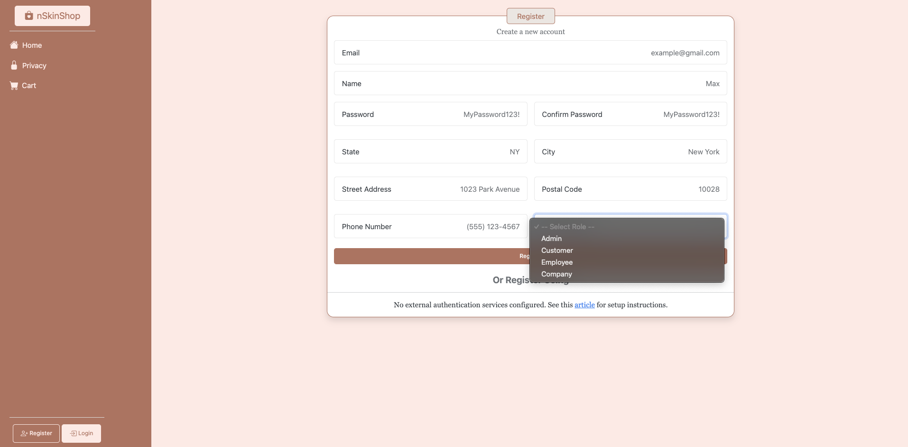

### _Customer user_

email: customer@gmail.com

password: SecureCustomerPassword123!

### _Admin user_

email: admin@gmail.com

password: SecureAdminPassword123!


# DESCRIPTION OF THE APPLICATION FROM THE USER'S POINT OF VIEW

### 1. Home Functionalities

After launching the application, navigation is visible on the left side (Home, Privacy, Cart), and at the bottom, there is an option to log in or register. The main view displays products available for sale.
 
A user without logging in can read about the privacy policy and view product details. However, accessing the cart or adding items to the cart requires logging in.

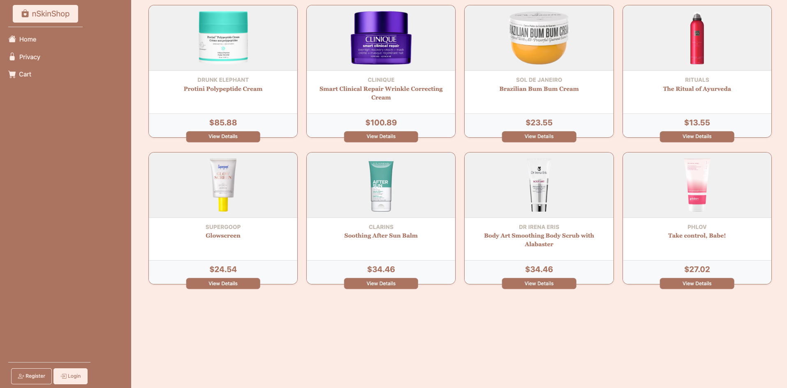
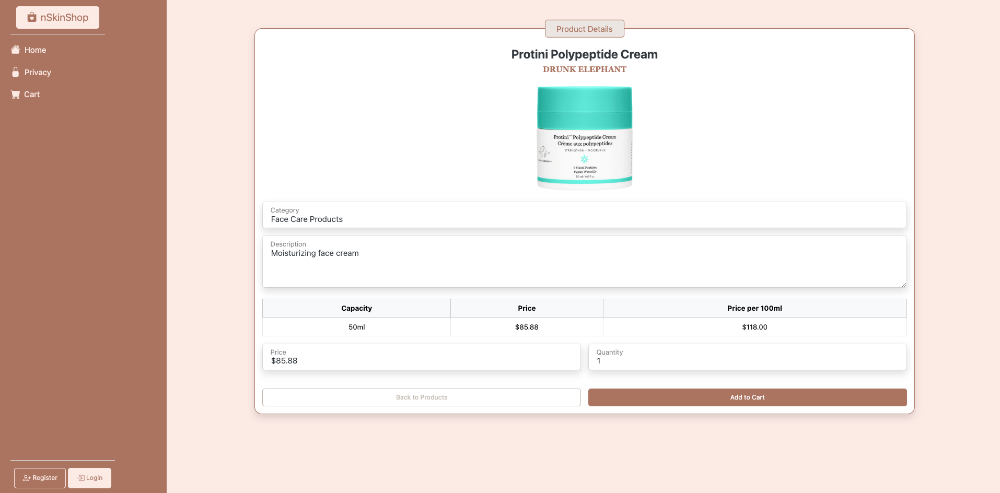
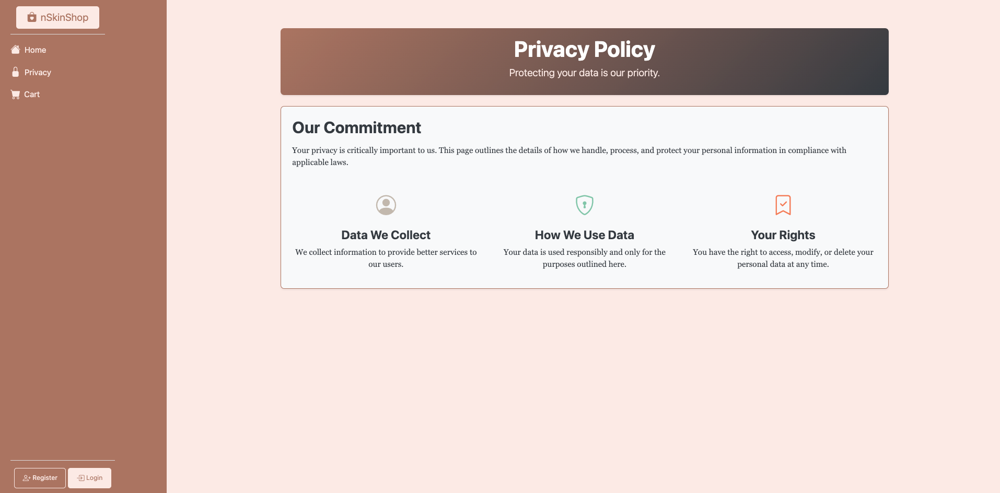
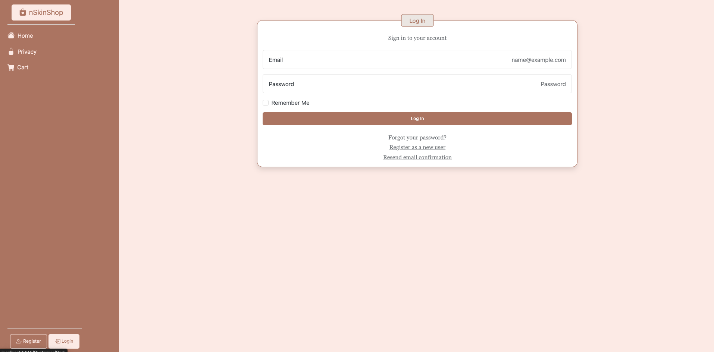
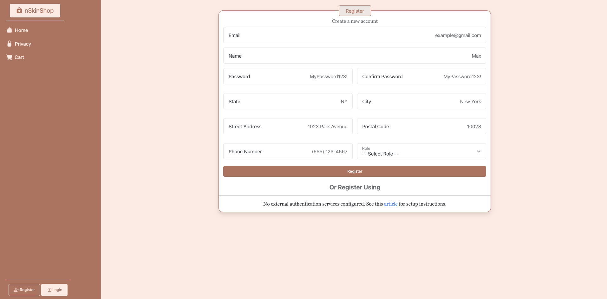


### 2. Admin Functionalities

After logging in, the admin user, like any other user, has access to their profile, the ability to manage content on the site, including categories, products, promotions, and companies, as well as access to the cart view and the ability to place orders.


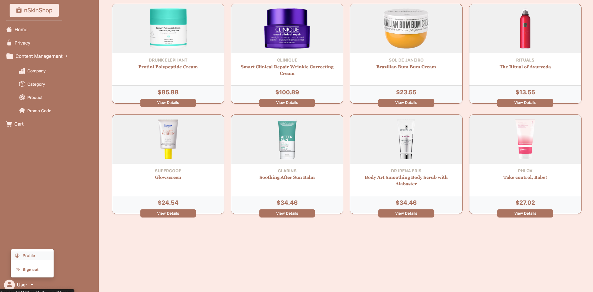

### Company CRUD

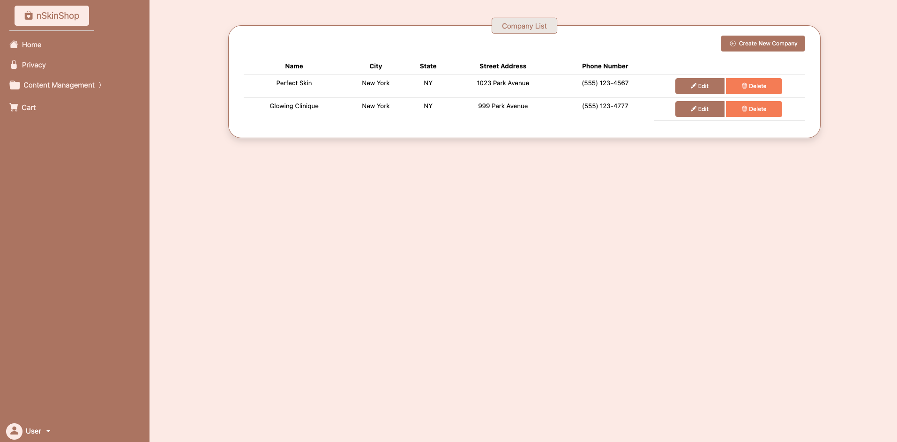
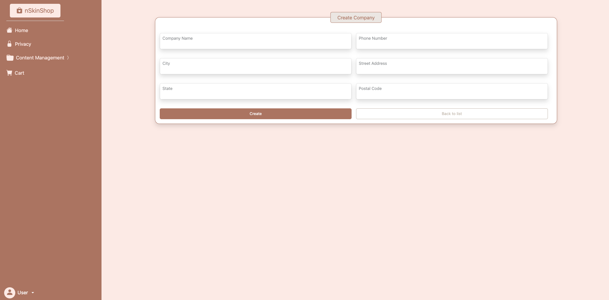
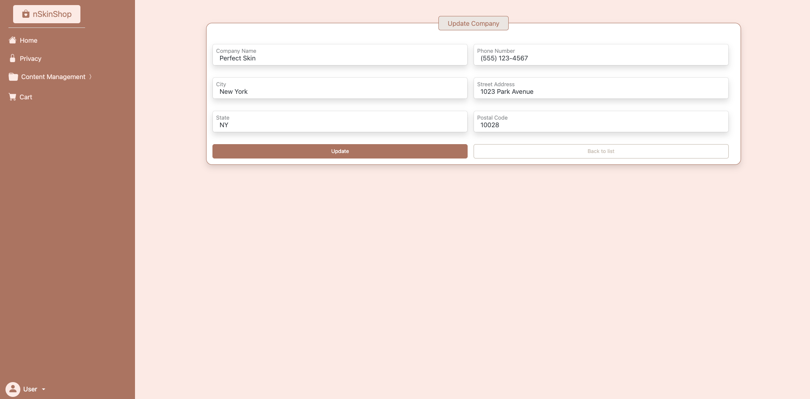
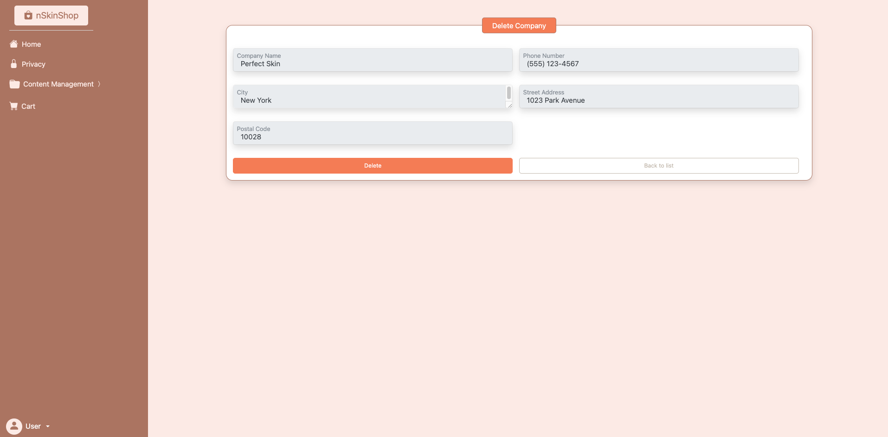

For the categories,promotions and product content management views are similar, the only difference is the product update view because of the image.

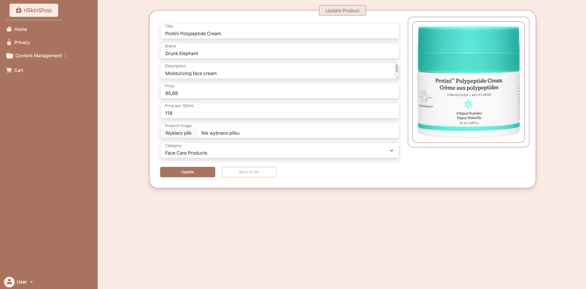

### 3. Customer Functionalities

The customer user, like the admin, has access to their profile and all the functionalities within it, as well as the ability to place orders. However, 
they do not have permission to manage the store’s content.

In the cart view user can increase or decrease the amount of products as well as delete them. 
After that he can go to the summary of the order when he can see shipping details and place the order if the information is correct.


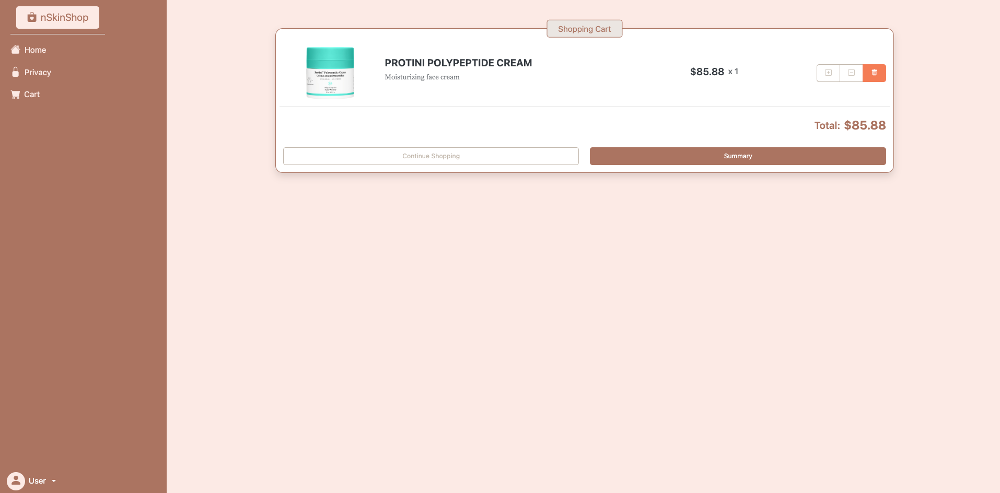
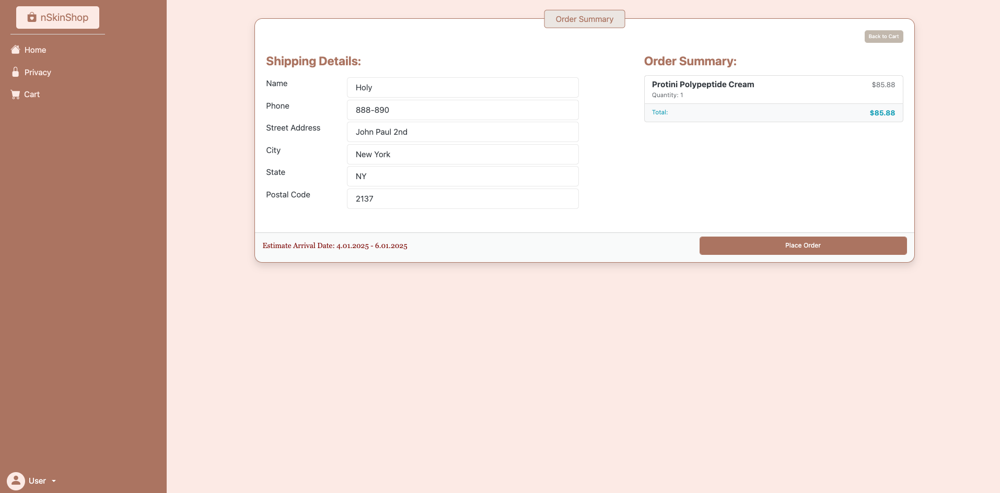
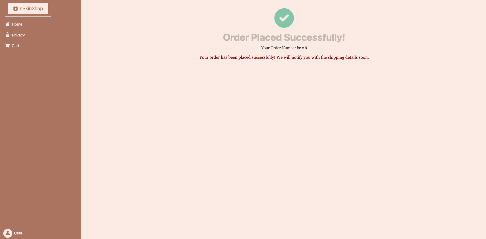

### User Profile View

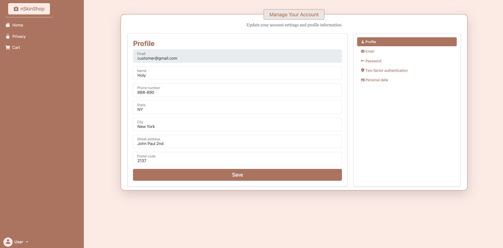
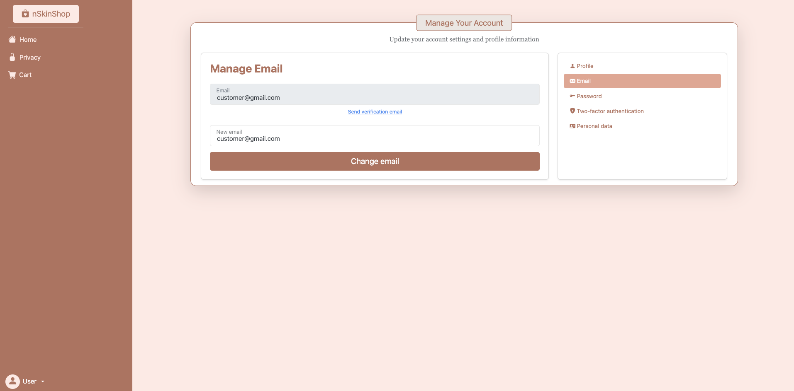
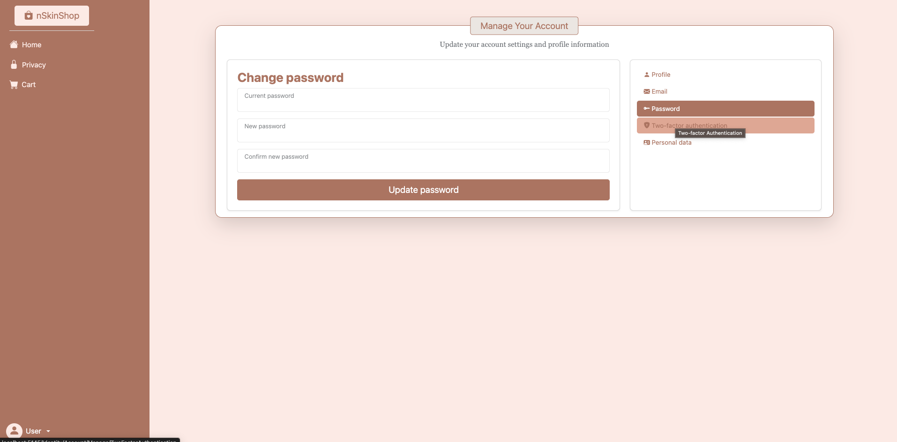
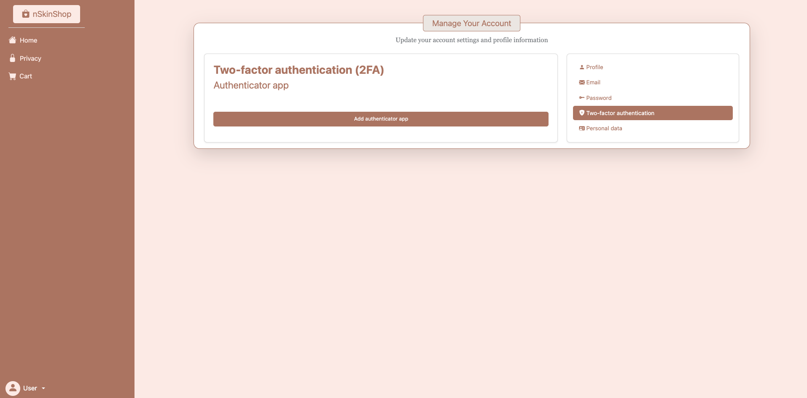
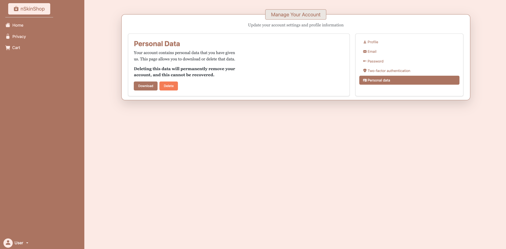